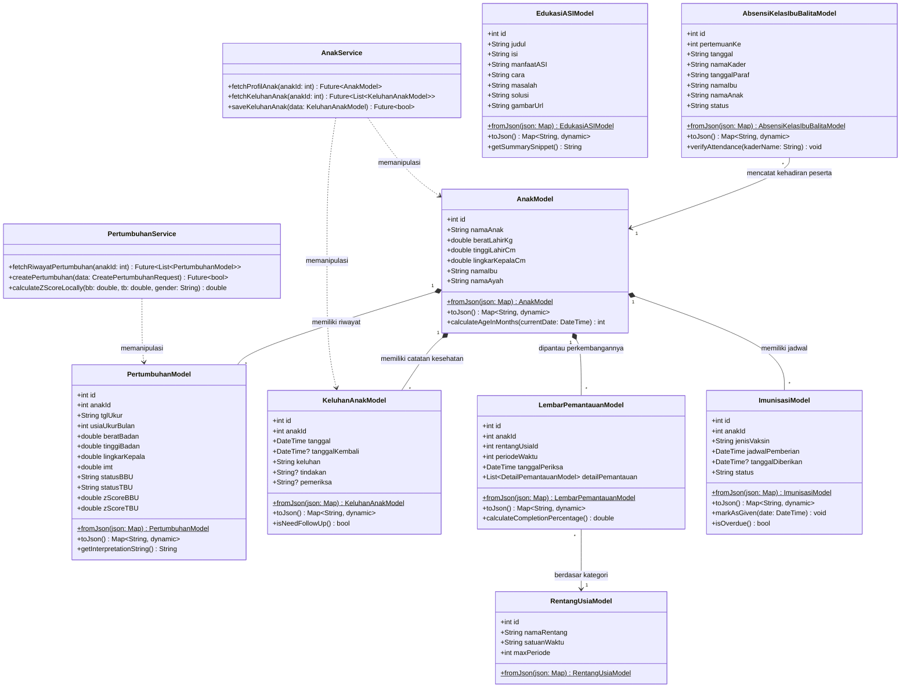

```mermaid
classDiagram
    %% --- Core Entities ---
    class AnakModel {
        +int id
        +String namaAnak
        +double beratLahirKg
        +double tinggiLahirCm
        +double lingkarKepalaCm
        +String namaIbu
        +String namaAyah
        +fromJson(json: Map) AnakModel$
        +toJson() Map~String, dynamic~
        +calculateAgeInMonths(currentDate: DateTime) int
    }

    class PertumbuhanModel {
        +int id
        +int anakId
        +String tglUkur
        +int usiaUkurBulan
        +double beratBadan
        +double tinggiBadan
        +double lingkarKepala
        +double imt
        +String statusBBU
        +String statusTBU
        +double zScoreBBU
        +double zScoreTBU
        +fromJson(json: Map) PertumbuhanModel$
        +toJson() Map~String, dynamic~
        +getInterpretationString() String
    }

    class KeluhanAnakModel {
        +int id
        +int anakId
        +DateTime tanggal
        +DateTime? tanggalKembali
        +String keluhan
        +String? tindakan
        +String? pemeriksa
        +fromJson(json: Map) KeluhanAnakModel$
        +toJson() Map~String, dynamic~
        +isNeedFollowUp() bool
    }

    class LembarPemantauanModel {
        +int id
        +int anakId
        +int rentangUsiaId
        +int periodeWaktu
        +DateTime tanggalPeriksa
        +List~DetailPemantauanModel~ detailPemantauan
        +fromJson(json: Map) LembarPemantauanModel$
        +toJson() Map~String, dynamic~
        +calculateCompletionPercentage() double
    }

    class RentangUsiaModel {
        +int id
        +String namaRentang
        +String satuanWaktu
        +int maxPeriode
        +fromJson(json: Map) RentangUsiaModel$
    }

    class AbsensiKelasIbuBalitaModel {
        +int id
        +int pertemuanKe
        +String tanggal
        +String namaKader
        +String tanggalParaf
        +String namaIbu
        +String namaAnak
        +String status
        +fromJson(json: Map) AbsensiKelasIbuBalitaModel$
        +toJson() Map~String, dynamic~
        +verifyAttendance(kaderName: String) void
    }

    class EdukasiASIModel {
        +int id
        +String judul
        +String isi
        +String manfaatASI
        +String cara
        +String masalah
        +String solusi
        +String gambarUrl
        +fromJson(json: Map) EdukasiASIModel$
        +toJson() Map~String, dynamic~
        +getSummarySnippet() String
    }

    class ImunisasiModel {
        +int id
        +int anakId
        +String jenisVaksin
        +DateTime jadwalPemberian
        +DateTime? tanggalDiberikan
        +String status
        +fromJson(json: Map) ImunisasiModel$
        +toJson() Map~String, dynamic~
        +markAsGiven(date: DateTime) void
        +isOverdue() bool
    }

    %% --- Services / Controllers (Business Logic) ---
    class PertumbuhanService {
        +fetchRiwayatPertumbuhan(anakId: int) Future~List~PertumbuhanModel~~
        +createPertumbuhan(data: CreatePertumbuhanRequest) Future~bool~
        +calculateZScoreLocally(bb: double, tb: double, gender: String) double
    }

    class AnakService {
        +fetchProfilAnak(anakId: int) Future~AnakModel~
        +fetchKeluhanAnak(anakId: int) Future~List~KeluhanAnakModel~~
        +saveKeluhanAnak(data: KeluhanAnakModel) Future~bool~
    }

    %% --- Relationships ---
    AnakModel "1" *-- "*" PertumbuhanModel : memiliki riwayat
    AnakModel "1" *-- "*" KeluhanAnakModel : memiliki catatan kesehatan
    AnakModel "1" *-- "*" LembarPemantauanModel : dipantau perkembangannya
    AnakModel "1" *-- "*" ImunisasiModel : memiliki jadwal
    
    LembarPemantauanModel "*" --> "1" RentangUsiaModel : berdasar kategori
    
    AbsensiKelasIbuBalitaModel "*" --> "1" AnakModel : mencatat kehadiran peserta
    
    PertumbuhanService ..> PertumbuhanModel : memanipulasi
    AnakService ..> AnakModel : memanipulasi
    AnakService ..> KeluhanAnakModel : memanipulasi
```
