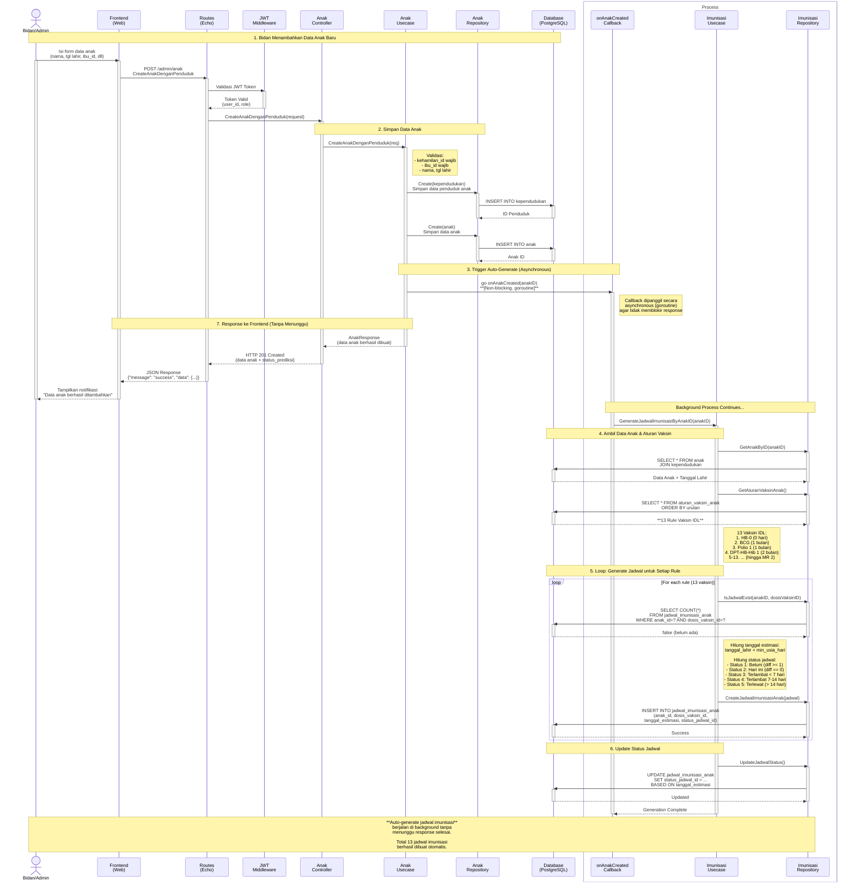

# Sequence Diagram 4.4 (Mermaid Format)

---

## Cara Melihat Diagram

### 1. **Menggunakan PlantUML**
- Install PlantUML extension di VS Code
- Buka file `sequence-diagram-4.4-penjadwalan-imunisasi-otomatis.puml`
- Klik kanan → Preview PlantUML Diagram

### 2. **Menggunakan Online Tool**
- PlantUML Online: https://www.plantuml.com/plantuml/uml/
- Copy isi file `.puml` dan paste di sana

### 3. **Menggunakan Mermaid (di Markdown)**
- GitHub, GitLab, Notion support Mermaid
- Copy kode Mermaid di atas ke Markdown file
- Akan otomatis ter-render

### 4. **Menggunakan Draw.io / Lucidchart**
- Import sequence diagram secara manual
- Menggunakan referensi alur di file penjelasan

---

## File yang Sudah Dibuat

1. ✅ **sequence-diagram-4.4-penjadwalan-imunisasi-otomatis.puml**
   - Format PlantUML (untuk rendering diagram)
   
2. ✅ **sequence-diagram-4.4-penjelasan.md**
   - Penjelasan lengkap step-by-step
   - Tabel 13 vaksin IDL
   - Status jadwal
   - Error handling
   
3. ✅ **sequence-diagram-4.4-mermaid.md** (file ini)
   - Format Mermaid (bisa di-render di GitHub/GitLab)

---

## Next Steps

Apakah Anda ingin:
1. ✅ Membuat diagram untuk **4.5 Notifikasi Pengingat Imunisasi**?
2. ✅ Membuat diagram untuk **4.6 Pencatatan Imunisasi**?
3. ✅ Membuat diagram untuk **4.7 Permintaan Perubahan Jadwal**?
4. 🖼️ Export diagram ke format **PNG/SVG**?
